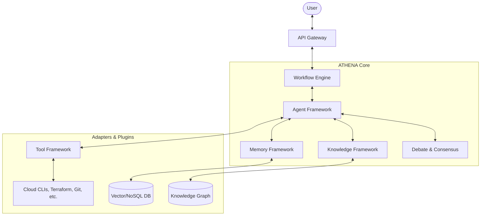

# High Level Architecture

## Metadata
- **Status**: Approved
- **Author**: Chief Software Architect
- **Version**: 1.0
- **Date**: 2024-05-22
- **Reviewers**: Chief AI Architect, Enterprise Architect

## Purpose
The purpose of this document is to define the system-wide architecture for ATHENA, identifying its core components, their responsibilities, and the patterns governing their interactions.

## Background
ATHENA is an enterprise-grade multi-agent AI consulting platform. The architecture must support autonomous operation, modularity, and elite consulting quality.

## Goals
1. **Define Core Components**: Establish the Workflow Engine, Agent Framework, Memory Framework, Tool Framework, Knowledge Framework, and Debate/Consensus Engines.
2. **Enforce Design Patterns**: Apply SOLID, DDD, Hexagonal Architecture, and Event-Driven principles.
3. **Ensure Extensibility**: Use a plugin-based architecture for agents and tools.
4. **Architectural Traceability**: Ensure every architectural decision is documented and traceable.

## Architecture

ATHENA follows a Hexagonal (Ports and Adapters) and Event-Driven architecture to decouple the core business logic (consulting workflows) from external services and tools.

### Core Components

1. **Workflow Engine**: Orchestrates the multi-agent consulting process from requirement analysis to final delivery.
2. **Agent Framework**: Manages agent lifecycles, states, and communications. Implements specialized roles (Chief Architect, Security Architect, etc.).
3. **Memory Framework**: Provides multi-tiered storage (Conversation, Working, Semantic, Long Term, Organizational).
4. **Tool Framework**: A plugin system for agents to interact with external tools (Terraform, CI/CD, Cloud CLIs).
5. **Knowledge Framework**: Stores architecture patterns, reference architectures, and standards.
6. **Debate & Consensus Engines**: Facilitates peer-review and disagreement among agents to reach optimal solutions.

### System Diagram

### Design Principles

- **SOLID**: Standard software engineering principles for maintainable code.
- **DDD (Domain Driven Design)**: The domain is "Enterprise AI Consulting".
- **Hexagonal Architecture**: Core logic is isolated from external LLM providers and infrastructure tools.
- **Async First**: All agent communications and tool executions are asynchronous.
- **Plugin Architecture**: New agent roles and tools can be added without modifying the core system.

## Implementation
The implementation will follow the phases defined in the Master Engineering Specification, beginning with the Agent Framework (Phase 5) and Knowledge Framework (Phase 6).

## Examples
*Process Flow*:
1. User submits an architecture request.
2. Workflow Engine initializes the "Solution Architecture" workflow.
3. Agent Framework spawns the Chief Architect and relevant specialists.
4. Agents consult the Knowledge Framework for patterns and Memory Framework for project context.
5. Debate Engine facilitates a review of the proposed architecture.
6. Documentation Office (Agent) generates the final deliverables via the Tool Framework.

## Acceptance Criteria
- Separation of core logic from external adapters verified by unit tests.
- Successful rendering of high-level sequence diagrams for a standard consulting workflow.
- Adherence to the plugin-based model for adding a new "Sample Agent".
- Compliance with the asynchronous communication model.

## References
- [Master Engineering Specification](../specifications/MASTER_ENGINEERING_SPECIFICATION.md)
- [Software Requirements Specification](../specifications/SOFTWARE_REQUIREMENTS_SPECIFICATION.md)
- [ADR 0005: Software Requirements Baseline](adr/0005-software-requirements-baseline.md)
