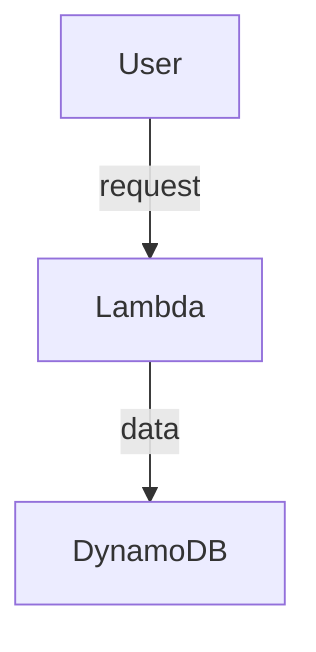

# Serverless Migration Strategy

## Executive Summary
**Status**: APPROVED
**Decision Maker**: chief-arch

### Rationale
Consensus reached based on final recommendation: Serverless Migration Strategy

## Detailed Recommendation

### Pros
- Cost efficiency
- Autoscaling

### Cons
- IAM complexity
- Monitoring overhead

### Alternatives
- Kubernetes (EKS)

### Tradeoffs
- Simplicity vs. Granular Control

### Impact Assessment
- **Risk**: Low
- **Cost**: Variable
- **Operational**: Medium
- **Security**: Neutral (if IAM followed)
- **Migration**: Significant

### Final Recommendation
Proceed with AWS Lambda and provisioned concurrency.

## Architecture Diagram

