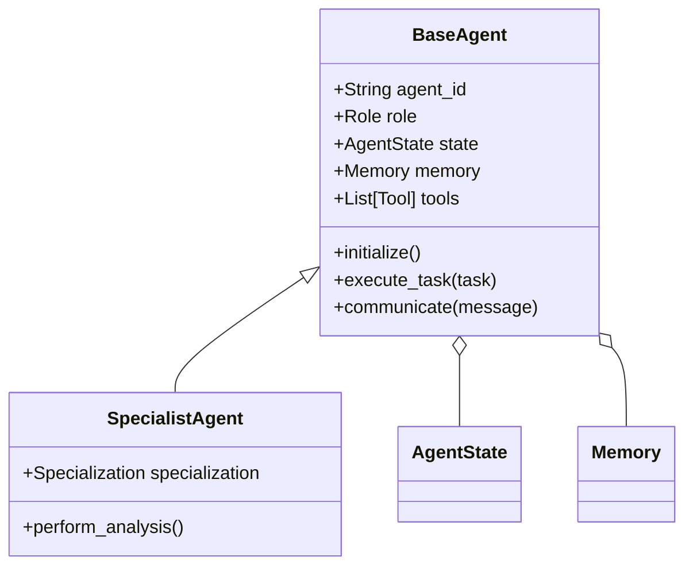

# Agent Framework Specification

## Metadata
- **Status**: Approved
- **Author**: Lead AI Architect
- **Version**: 1.0
- **Date**: 2024-05-22
- **Reviewers**: Chief Architect, LLMOps Architect

## Purpose
The purpose of this document is to define the technical design and implementation requirements for the ATHENA Agent Framework. This framework is the core engine that manages the lifecycle, state, and execution of specialized AI agents.

## Background
ATHENA operates as a multi-agent autonomous consulting organization. A robust framework is required to ensure consistent behavior, reliable communication, and strict adherence to defined roles across all agents.

## Goals
1. **Standardize Agent Structure**: Define a consistent structure for all agents (Role, Goals, Memory, Tools, Skills).
2. **Implement Lifecycle Management**: Manage agent initialization, execution, and termination.
3. **Ensure Async Communication**: Enable efficient, non-blocking communication between agents and the Workflow Engine.
4. **Enforce Role-Based Behavior**: Ensure agents operate strictly within their documented responsibilities and escalation rules.

## Requirements

### Functional Requirements
1. **Agent Definition**:
   - Every agent must have a unique ID, Role, and Set of Responsibilities.
   - Support for defining Goals, Skills, and specific Prompt templates per agent.
2. **State Management**:
   - Implementation of a state machine (e.g., Idle, Thinking, Acting, Communicating, Reviewing, Completed).
   - Persistence of agent state to support long-running workflows.
3. **Communication Protocol**:
   - standard format for messages between agents.
   - Support for task delegation, feedback loops, and status updates.
4. **Memory Integration**:
   - Interface for agents to interact with the multi-tiered Memory Framework.
5. **Tool Execution**:
   - Capability to invoke tools defined in the Tool Framework.

### Technical Requirements
1. **Base Class Implementation**: A `BaseAgent` class that provides common functionality.
2. **Asynchronous Execution**: Using `asyncio` for all agent operations.
3. **Typed Interfaces**: Use Pydantic models for agent configuration and message schemas.
4. **Extensibility**: Easy registration of new agent types and roles.

## Architecture



### Agent Components
- **Role**: Defines who the agent is (e.g., "Security Architect").
- **Goals**: What the agent is trying to achieve.
- **Memory**: Local and shared context.
- **Tools**: Pluggable capabilities (e.g., "Cloud Scanner").
- **Prompt**: The core instruction set governing the LLM interaction.

## Implementation
Implementation begins with the `BaseAgent` and core models in `src/athena/core`.

## Examples
*Agent Initialization*:
```python
security_agent = SecurityArchitect(
    agent_id="sec-001",
    tools=[CloudScanner(), ComplianceChecker()]
)
await security_agent.initialize()
```

## Acceptance Criteria
- Every agent role defined in the Master Specification can be instantiated using the framework.
- Successful state transition from 'Idle' to 'Completed' for a sample task.
- Verification of message delivery between two agents.
- Compliance with the asynchronous execution model (no blocking calls).

## References
- [Master Engineering Specification](../specifications/MASTER_ENGINEERING_SPECIFICATION.md)
- [High Level Architecture](../architecture/HIGH_LEVEL_ARCHITECTURE.md)
- [ADR 0006: High Level Architecture Baseline](../architecture/adr/0006-high-level-architecture-baseline.md)
