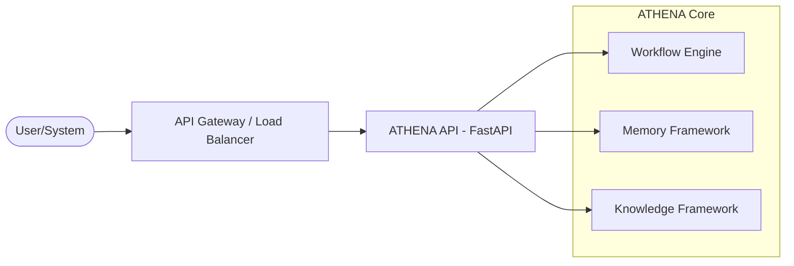

# API Framework Specification

## Metadata
- **Status**: Approved
- **Author**: Lead Software Architect
- **Version**: 1.0
- **Date**: 2024-05-22
- **Reviewers**: Chief Architect, Security Architect

## Purpose
The purpose of this document is to define the technical design and implementation requirements for the ATHENA API Framework. This framework provides the primary interface for external users and systems to interact with the platform.

## Background
ATHENA functions as an autonomous consulting organization. An enterprise-grade API is required to submit requirements, track consulting workflows, review agent outputs, and retrieve final deliverables.

## Goals
1. **Provide Unified Access**: Offer a single RESTful entry point for all ATHENA capabilities.
2. **Support Asynchronous Operations**: Ensure the API can handle long-running consulting workflows without blocking.
3. **Enable Observability**: Provide endpoints to monitor agent state and workflow progress.
4. **Ensure Security**: Implement authentication, authorization, and audit logging for all API interactions.

## Requirements

### Functional Requirements
1. **Workflow Management**:
   - Create, list, retrieve, and cancel consulting workflows.
2. **Agent Status**:
   - Query the current state and activity of active agents.
3. **Deliverable Retrieval**:
   - Download generated documents and diagrams.
4. **Memory Access**:
   - (Restricted) Access to project-scoped memory and consensus reports.

### Technical Requirements
1. **FastAPI Implementation**: Use FastAPI for high-performance, asynchronous API development.
2. **OpenAPI (Swagger)**: Automatically generate and expose OpenAPI specifications.
3. **Typed Request/Response**: Use Pydantic models for all API interactions.
4. **Middleware**: Implement standard middleware for logging, CORS, and error handling.

## Architecture



## Implementation
Implementation begins with the basic FastAPI application structure and foundational routes in `src/athena/api/`.

## Examples
*Create Workflow*:
`POST /api/v1/workflows`
```json
{
  "project_id": "migration-001",
  "workflow_type": "cloud-migration-analysis"
}
```

## Acceptance Criteria
- Successful initialization of a FastAPI server.
- Automatically generated Swagger UI accessible at `/docs`.
- Implementation of at least one functional endpoint (e.g., `GET /health`).
- All endpoints must return typed Pydantic responses.

## References
- [Master Engineering Specification](../specifications/MASTER_ENGINEERING_SPECIFICATION.md)
- [Workflow Engine Specification](WORKFLOW_ENGINE_SPECIFICATION.md)
- [ADR 0013: Document Engine Design](../architecture/adr/0013-document-engine-design.md)
