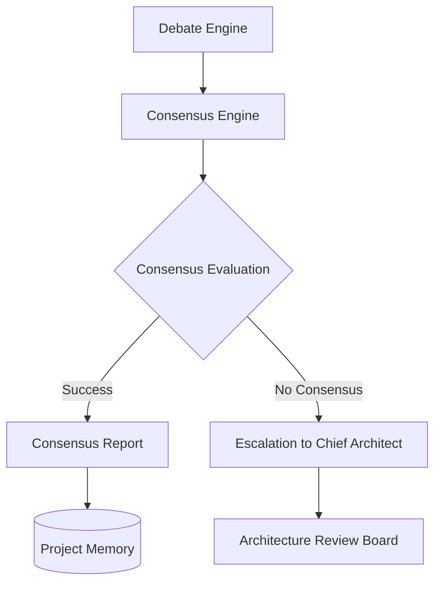

# Consensus Engine Specification

## Metadata
- **Status**: Approved
- **Author**: Chief Architect
- **Version**: 1.0
- **Date**: 2024-05-22
- **Reviewers**: Senior Solution Architect, Quality Reviewer

## Purpose
The purpose of this document is to define the technical design and implementation requirements for the ATHENA Consensus Engine. This engine is responsible for evaluating the outputs of the Debate Engine and determining the final architectural path or escalating to the Chief Architect if a consensus cannot be reached.

## Background
After specialist agents have debated a proposal, a final decision must be made. The Consensus Engine provides the logic to move from a multi-agent debate to a single, authoritative recommendation.

## Goals
1. **Determine Final Outcome**: Evaluate debate history and structured recommendations to reach a final decision.
2. **Handle Disagreements**: Implement logic for cases where agents cannot reach a consensus.
3. **Escalation Management**: Provide a formal mechanism for escalating unresolved architectural conflicts to the Chief Architect.
4. **Final Approval Support**: Interface with the Architecture Review Board (ARB) for final platform-wide approval.

## Requirements

### Functional Requirements
1. **Consensus Evaluation**:
   - Analyze the final recommendations from the Debate Engine.
   - Support for different consensus models (e.g., Unanimous, Majority, Reviewer-led).
2. **Outcome Generation**:
   - Produce a "Consensus Report" summarizing the decision and the reasoning.
   - Record the final decision in the Project Memory.
3. **Escalation Logic**:
   - Automatically trigger an escalation if the debate rounds exceed limits without a clear consensus.
4. **Approval Workflow Integration**:
   - Provide hooks for the Chief Architect or ARB to review and sign off on the consensus.

### Technical Requirements
1. **Pluggable Evaluation Logic**: Support for different algorithms to determine consensus.
2. **Traceability**: Every consensus decision must be linked back to the originating debate session.
3. **Async Processing**: Evaluation should be non-blocking.

## Architecture

## Implementation
Implementation begins with the `ConsensusEngine` in `src/athena/core/consensus.py`.

## Examples
*Consensus Process*:
1. Debate Engine provides a recommendation with one Proposer and two Challengers.
2. Consensus Engine evaluates the tradeoffs and determines the "refinement" adequately addressed the challenges.
3. Final decision is marked as "Approved with Conditions".

## Acceptance Criteria
- Successful determination of consensus for a debated proposal.
- Correct handling of an "unresolved" debate by triggering an escalation.
- Generation of a valid Consensus Report in the Project Memory.
- Integration with the Debate Engine's structured output.

## References
- [Master Engineering Specification](../specifications/MASTER_ENGINEERING_SPECIFICATION.md)
- [Debate Engine Specification](DEBATE_ENGINE_SPECIFICATION.md)
- [ADR 0011: Debate Engine Design](../architecture/adr/0011-debate-engine-design.md)
