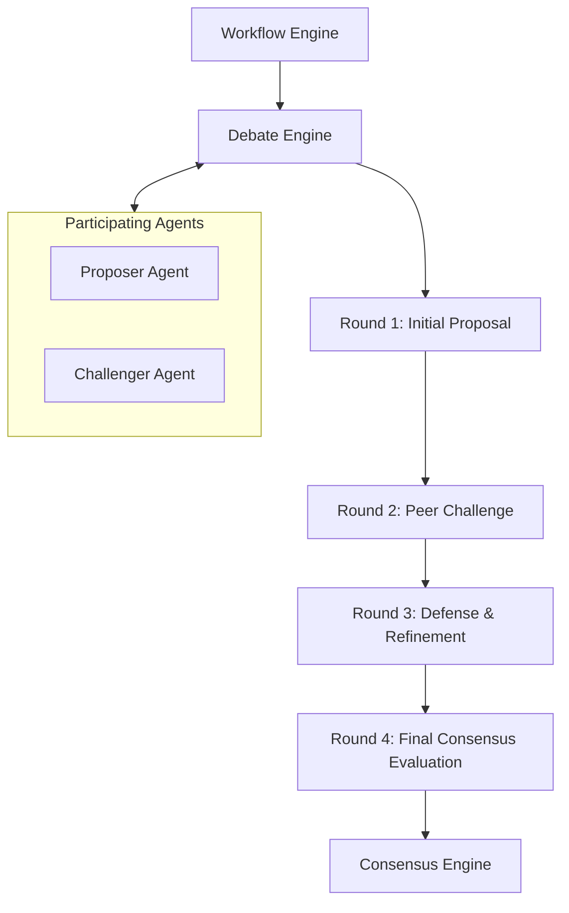

# Debate Engine Specification

## Metadata
- **Status**: Approved
- **Author**: Chief Architect
- **Version**: 1.0
- **Date**: 2024-05-22
- **Reviewers**: Senior Solution Architect, Chief AI Architect

## Purpose
The purpose of this document is to define the technical design and implementation requirements for the ATHENA Debate Engine. This engine is a core differentiator that ensures architectural quality by mandating that agents challenge proposals and explore tradeoffs rather than simply agreeing.

## Background
Standard multi-agent systems often suffer from "conformation bias" where agents quickly agree on a sub-optimal solution. ATHENA's Debate Engine forces a critical analysis of every architectural recommendation.

## Goals
1. **Prevent Simple Consensus**: Force agents to challenge every proposal with critical analysis.
2. **Standardize Recommendations**: Ensure every recommendation includes Pros, Cons, Alternatives, Tradeoffs, Risks, and Impacts.
3. **Orchestrate Multi-Round Debates**: Manage iterative cycles of challenge and response between specialist agents.
4. **Capture Rational**: Ensure the reasoning behind architectural decisions is fully documented and traceable.

## Requirements

### Functional Requirements
1. **Debate Orchestration**:
   - Capability to initialize a debate session for a specific architectural proposal.
   - Manage multiple rounds of "Challenge" and "Defense" between agents.
2. **Structured Outputs**:
   - Mandate the following sections in final recommendations:
     - Pros
     - Cons
     - Alternatives
     - Tradeoffs
     - Risk
     - Cost
     - Operational Impact
     - Security Impact
     - Migration Impact
     - Final Recommendation
3. **Agent Integration**:
   - Agents must be able to "Submit Proposal", "Challenge Proposal", and "Refine Proposal".
4. **Resolution**:
   - Mechanism to conclude a debate when a defined level of rigor is met or a round limit is reached.

### Technical Requirements
1. **Async Iteration**: The debate process must be non-blocking.
2. **Persistence**: Debate sessions and their history must be stored in the Project Memory.
3. **Pydantic Models**: Use typed models for recommendations and debate states.

## Architecture

## Implementation
Implementation begins with the `DebateEngine` and `Recommendation` models in `src/athena/core/debate.py`.

## Examples
*Debate Cycle*:
1. Cloud Architect proposes "Serverless Backend".
2. Security Architect challenges with "Cold Start vs. Security Isolation" tradeoffs.
3. FinOps Architect challenges with "Unpredictable Cost Model".
4. Cloud Architect refines the proposal with "Provisioned Concurrency and Cost Caps".

## Acceptance Criteria
- Successful completion of a 3-round debate between two agents.
- Verification that the final output contains all 10 mandatory recommendation sections.
- Demonstration of a proposal being rejected or significantly modified due to a successful challenge.
- Full traceability of the debate history in the project memory.

## References
- [Master Engineering Specification](../specifications/MASTER_ENGINEERING_SPECIFICATION.md)
- [Software Requirements Specification](../specifications/SOFTWARE_REQUIREMENTS_SPECIFICATION.md)
- [Agent Framework Specification](AGENT_FRAMEWORK_SPECIFICATION.md)
