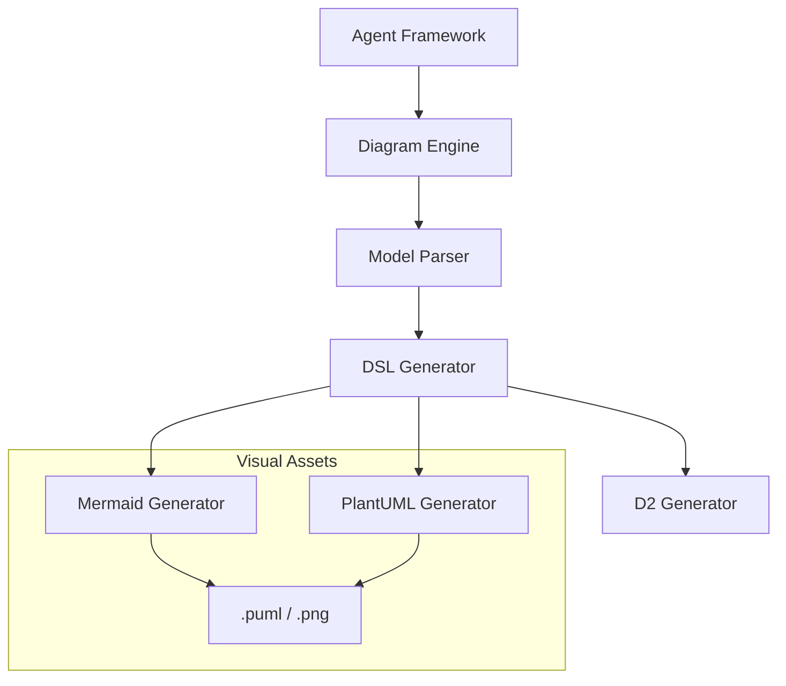

# Diagram Engine Specification

## Metadata
- **Status**: Approved
- **Author**: Diagram Specialist
- **Version**: 1.0
- **Date**: 2024-05-22
- **Reviewers**: Chief Architect, Senior Solution Architect

## Purpose
The purpose of this document is to define the technical design and implementation requirements for the ATHENA Diagram Engine. This engine is responsible for transforming architectural models and agent descriptions into visual representations using Diagram-as-Code technologies.

## Background
Architectural consulting is heavily dependent on visual communication. The Diagram Engine allows ATHENA agents to programmatically generate complex diagrams (sequence, flowchart, cloud architecture) to accompany their textual recommendations.

## Goals
1. **Automate Diagram Generation**: Produce high-quality architecture diagrams from structured agent content.
2. **Support Multiple DSLs**: Initial support for Mermaid and PlantUML.
3. **Ensure Consistency**: Enforce standard visual styles and layouts across all generated diagrams.
4. **Integrate with Document Engine**: Provide diagrams in formats suitable for inclusion in Word, PowerPoint, and Markdown reports.

## Requirements

### Functional Requirements
1. **Diagram Types**:
   - Cloud Architecture (Nodes, Regions, VPCs).
   - Sequence Diagrams (Agent interactions, Data flows).
   - Flowcharts (Decision logic, Workflows).
   - Class/ER Diagrams (Data models, Component structures).
2. **DSL Generation**:
   - Transform structured architectural data into Mermaid and PlantUML syntax.
3. **Validation**:
   - Capability to validate generated syntax before outputting.
4. **Integration**:
   - Expose an interface for agents to "Request Diagram" for a specific set of components.

### Technical Requirements
1. **Model-to-DSL Mapping**: Define clear mappings between internal architectural models and diagram DSLs.
2. **Async Execution**: Diagram generation should be non-blocking.
3. **Extensibility**: Support for adding new diagram types and DSLs via a provider pattern.

## Architecture



## Implementation
Implementation begins with the `DiagramEngine` and basic Mermaid generators for flowcharts and sequence diagrams in `src/athena/core/diagram.py`.

## Examples
*Diagram Generation*:
```python
diagram = await diagram_engine.generate_cloud_architecture(
    components=[{"name": "WebSvr", "type": "EC2"}, {"name": "DB", "type": "RDS"}],
    format="mermaid"
)
```

## Acceptance Criteria
- Successful generation of valid Mermaid flowchart syntax from a list of steps.
- Successful generation of a PlantUML sequence diagram from a set of interactions.
- Integration with the Document Engine to embed diagrams in generated reports.
- Adherence to the project's visual standards (as defined in ADRs).

## References
- [Master Engineering Specification](../specifications/MASTER_ENGINEERING_SPECIFICATION.md)
- [Document Engine Specification](DOCUMENT_ENGINE_SPECIFICATION.md)
- [ADR 0003: Documentation Standards](../architecture/adr/0003-documentation-standards.md)
