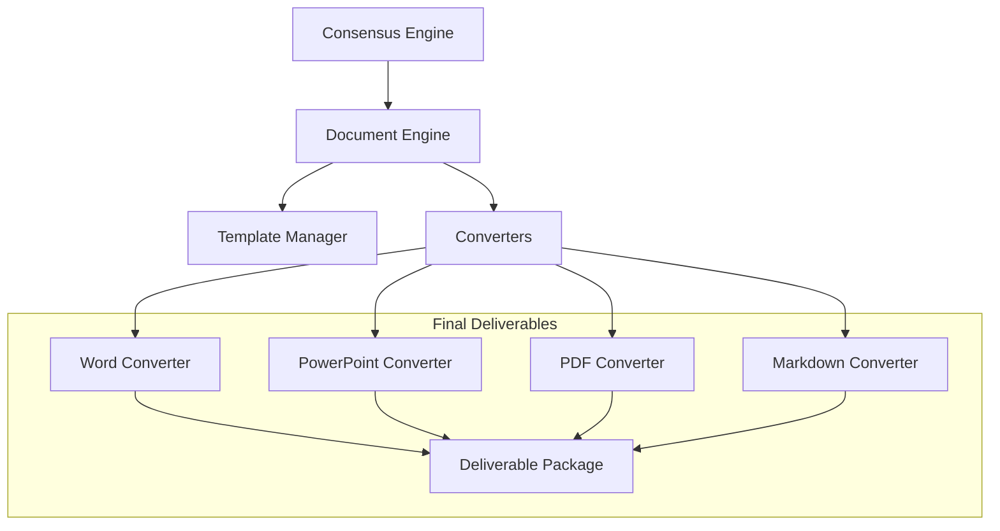

# Document Engine Specification

## Metadata
- **Status**: Approved
- **Author**: Documentation Specialist
- **Version**: 1.0
- **Date**: 2024-05-22
- **Reviewers**: Chief Architect, Technical Writer

## Purpose
The purpose of this document is to define the technical design and implementation requirements for the ATHENA Document Engine. This engine is responsible for transforming architectural recommendations, consensus reports, and analysis results into professional-grade consulting deliverables (Word, PowerPoint, PDF, Markdown).

## Background
The final value delivered by ATHENA to its clients is high-quality documentation. The Document Engine ensures that agent outputs are presented in a consistent, enterprise-ready format.

## Goals
1. **Automate Deliverable Generation**: Produce Word, PowerPoint, and PDF documents from structured agent content.
2. **Ensure Consistency**: Enforce standard enterprise templates across all deliverables.
3. **Support Multi-Format Output**: Provide flexibility to generate documentation in various formats as required by the client.
4. **Integrate with Workflow**: Automatically trigger document generation as part of the "Final Delivery" stage of the workflow.

## Requirements

### Functional Requirements
1. **Template Management**:
   - Capability to manage and apply document templates.
   - Support for dynamic content insertion into predefined sections.
2. **Document Conversion**:
   - Convert Markdown and structured JSON/Pydantic models into Word, PowerPoint, and PDF.
3. **Deliverable Packaging**:
   - Aggregate multiple documents and diagrams into a final deliverable package.
4. **Versioning**:
   - Support for versioning and metadata inclusion in all generated documents.

### Technical Requirements
1. **Library Support**: Use reliable libraries for document generation (e.g., `python-docx`, `python-pptx`, `pandoc`).
2. **Async Generation**: Document generation should be an asynchronous background task.
3. **Pluggable Converters**: Support for adding new output formats via a plugin system.

## Architecture



## Implementation
Implementation begins with the `DocumentEngine` and basic Markdown/Text converters in `src/athena/core/document.py`.

## Examples
*Document Generation*:
```python
package = await document_engine.generate_package(
    consensus_report=report,
    formats=["docx", "pdf"]
)
```

## Acceptance Criteria
- Successful generation of a Markdown document from a Consensus Report.
- Verification that generated documents contain all required sections from the recommendation schema.
- Demonstration of a multi-format delivery package.
- Adherence to the project's styling and metadata standards.

## References
- [Master Engineering Specification](../specifications/MASTER_ENGINEERING_SPECIFICATION.md)
- [Consensus Engine Specification](CONSENSUS_ENGINE_SPECIFICATION.md)
- [ADR 0003: Documentation Standards](../architecture/adr/0003-documentation-standards.md)
