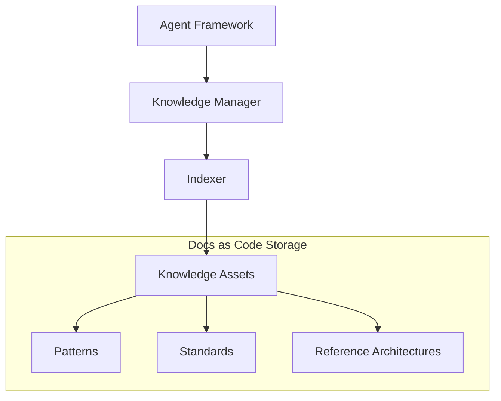

# Knowledge Framework Specification

## Metadata
- **Status**: Approved
- **Author**: Lead Knowledge Architect
- **Version**: 1.0
- **Date**: 2024-05-22
- **Reviewers**: Chief Architect, Documentation Specialist

## Purpose
The purpose of this document is to define the technical design and implementation requirements for the ATHENA Knowledge Framework. This framework is responsible for storing, organizing, and providing access to the organizational intelligence required by agents.

## Background
To perform elite consulting, ATHENA agents must have access to a vast library of architecture patterns, security standards, cloud best practices, and lessons learned from past projects.

## Goals
1. **Centralize Knowledge Assets**: Provide a single point of truth for all architectural and engineering standards.
2. **Enable Agent Access**: Implement interfaces for agents to query and retrieve relevant knowledge.
3. **Support Standards Management**: Provide a structured way to manage cloud, security, and networking standards.
4. **Maintain Versioned Knowledge**: Ensure knowledge assets are versioned and traceable.

## Requirements

### Functional Requirements
1. **Knowledge Categories**:
   - Architecture Patterns (e.g., Microservices, Event-Driven).
   - Reference Architectures (e.g., AWS Landing Zone).
   - Security Standards (e.g., CIS Benchmarks).
   - Cloud Standards (e.g., Well-Architected Framework).
   - Lessons Learned (from past consulting projects).
2. **Search and Retrieval**:
   - Capability to search knowledge assets by tags, category, and content.
   - Support for semantic search (in future phases).
3. **Asset Metadata**:
   - Every knowledge asset must have metadata (Title, Author, Version, Status, Tags).

### Technical Requirements
1. **Markdown-Based Storage**: All knowledge assets are stored as Markdown files in the `docs/knowledge/` directory.
2. **Indexing**: Implementation of a lightweight indexer to provide fast access to knowledge assets.
3. **Integration**: Integration with the Agent Framework for direct asset retrieval by agents.

## Architecture



## Implementation
Implementation begins with the `KnowledgeManager` and basic asset indexing in `src/athena/core/knowledge.py`.

## Examples
*Agent Query*:
```python
patterns = await knowledge_manager.get_assets_by_tag("microservices")
best_practice = await knowledge_manager.get_standard("aws-iam-best-practices")
```

## Acceptance Criteria
- Successful retrieval of a sample architecture pattern by the Agent Framework.
- Verification that all knowledge assets follow the defined metadata structure.
- Implementation of a search interface for agents.
- Compliance with the "Docs as Code" approach (knowledge stored in Git).

## References
- [Master Engineering Specification](../specifications/MASTER_ENGINEERING_SPECIFICATION.md)
- [High Level Architecture](../architecture/HIGH_LEVEL_ARCHITECTURE.md)
- [ADR 0003: Documentation Standards](../architecture/adr/0003-documentation-standards.md)
