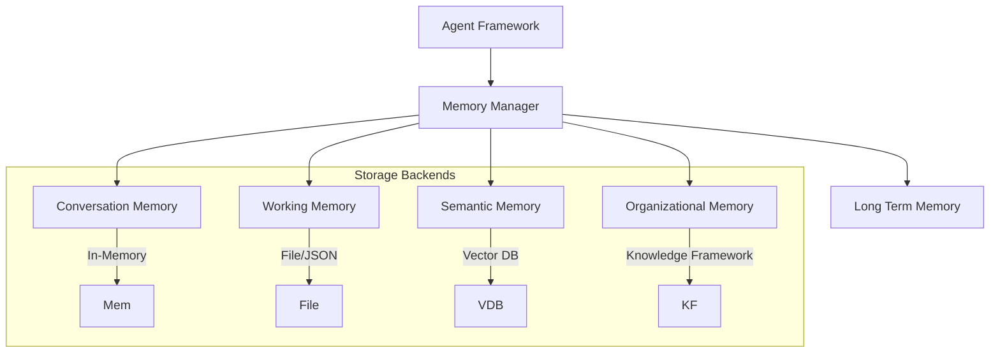

# Memory Framework Specification

## Metadata
- **Status**: Approved
- **Author**: Lead AI Architect
- **Version**: 1.0
- **Date**: 2024-05-22
- **Reviewers**: Chief Architect, Data Architect

## Purpose
The purpose of this document is to define the technical design and implementation requirements for the ATHENA Memory Framework. This framework provides agents with the ability to store, retrieve, and share context across different time scales and scopes.

## Background
Elite consulting requires deep context. Agents must remember not only the current conversation but also the intermediate steps of a task, past project experiences, and organizational-wide knowledge.

## Goals
1. **Multi-Tiered Storage**: Implement distinct tiers for different memory needs (Conversation, Working, Semantic, Long Term, Organizational).
2. **Context Persistence**: Ensure critical context is maintained across agent restarts and long-running workflows.
3. **Efficient Retrieval**: Provide fast and relevant context retrieval for agents.
4. **Context Sharing**: Enable controlled sharing of memory between different agents working on the same project.

## Requirements

### Functional Requirements
1. **Memory Tiers**:
   - **Conversation Memory**: Short-term history of the current interaction.
   - **Working Memory**: Task-specific intermediate results and state.
   - **Semantic Memory**: Knowledge retrieved via semantic similarity (e.g., Vector DB).
   - **Long Term Memory**: History of past projects and decisions.
   - **Organizational Memory**: Company-wide standards and common knowledge (integrated with Knowledge Framework).
2. **Memory Operations**:
   - Store, Retrieve, Search, and Clear operations per tier.
   - Support for expiration/TTL for short-term tiers.
3. **Scoping**:
   - Support for Session-scope, Project-scope, and Organization-scope memory.

### Technical Requirements
1. **Abstract Interface**: A unified `MemoryManager` and `MemoryProvider` interface.
2. **Pluggable Backends**: Initial support for In-Memory and JSON-file storage, with hooks for Redis and Vector DBs in later phases.
3. **Serialization**: Use Pydantic models for structured memory objects.

## Architecture



## Implementation
Implementation begins with the `MemoryManager` and the Conversation/Working memory tiers in `src/athena/core/memory.py`.

## Examples
*Agent Memory Access*:
```python
await memory_manager.store_conversation("agent-1", "user-msg", "Hello")
context = await memory_manager.get_working_context("project-x")
```

## Acceptance Criteria
- Successful storage and retrieval of a conversation thread.
- Persistence of working memory across a simulated task restart.
- Demonstration of project-scoped memory shared between two different agents.
- Verification of clear separation between different memory tiers.

## References
- [Master Engineering Specification](../specifications/MASTER_ENGINEERING_SPECIFICATION.md)
- [Software Requirements Specification](../specifications/SOFTWARE_REQUIREMENTS_SPECIFICATION.md)
- [Knowledge Framework Specification](KNOWLEDGE_FRAMEWORK_SPECIFICATION.md)
