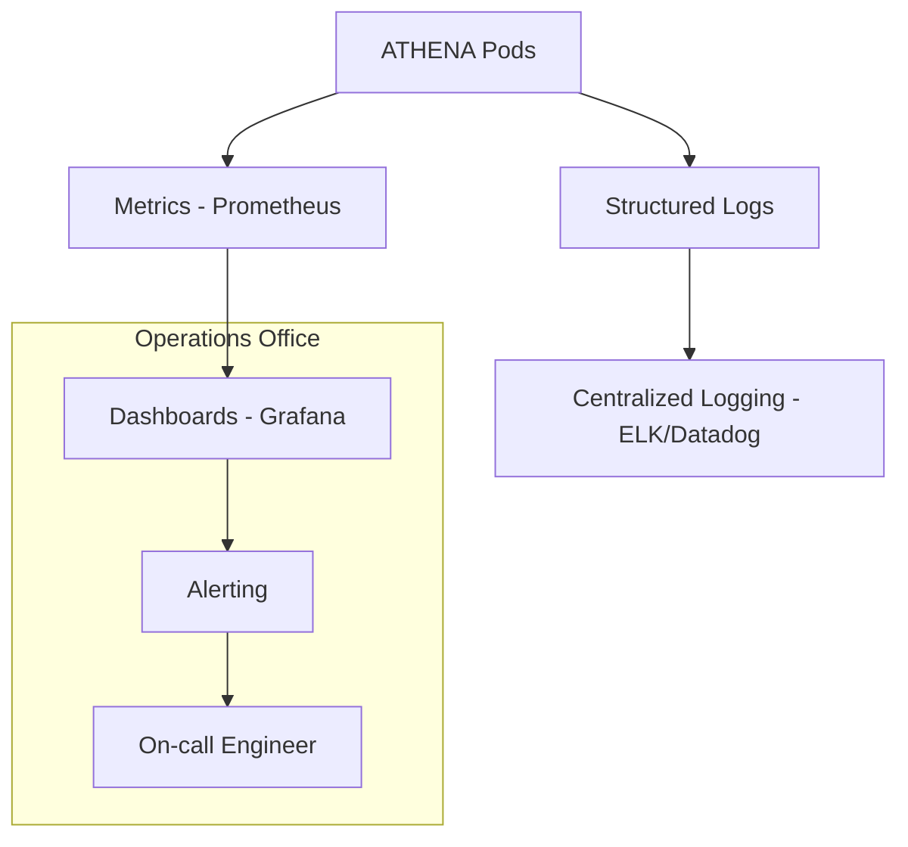

# Operations Specification

## Metadata
- **Status**: Approved
- **Author**: Operations Architect
- **Version**: 1.0
- **Date**: 2024-05-22
- **Reviewers**: Chief Architect, DevOps Lead

## Purpose
The purpose of this document is to define the operational requirements and procedures for the ATHENA platform. It establishes the standards for monitoring, logging, performance management, and incident response.

## Background
To maintain an elite AI consulting platform, ATHENA must be reliable, observable, and easy to manage in a production environment. Operational excellence ensures that agent workflows are performed efficiently and that any issues are quickly identified and resolved.

## Goals
1. **Maximize Platform Availability**: Ensure the API and core engines are highly available.
2. **Provide Full Observability**: Implement comprehensive logging and metrics for all agent interactions.
3. **Automate Performance Monitoring**: Track LLM latency, token usage, and engine throughput.
4. **Standardize Incident Management**: Define clear procedures for handling platform failures and agent misbehavior.

## Requirements

### Observability
1. **Structured Logging**:
   - Every agent action, workflow transition, and tool execution must be logged in a structured format (JSON).
   - Logs must include Trace ID and Project ID for cross-engine correlation.
2. **Metrics & Monitoring**:
   - Monitor API health (latency, error rates).
   - Track agent-specific metrics (Tasks completed, Debate rounds, Tokens used).
   - Resource monitoring for the Kubernetes cluster (CPU, Memory).
3. **Dashboards**:
   - Provide real-time dashboards for system health and consulting throughput (e.g., via Grafana).

### Maintenance & Scaling
1. **Scaling Policies**:
   - Automated horizontal scaling of API pods based on load.
   - Resource quotas for intensive agent tasks.
2. **Backup & Recovery**:
   - Automated backups of Project and Organizational memory.
   - Disaster recovery procedure for the K8s cluster.

## Architecture



## Implementation
Implementation begins with structured logging integration in `src/athena/core/` and metrics instrumentation in `src/athena/api/`.

## Examples
*Log Entry*:
```json
{
  "timestamp": "2024-05-22T10:00:00Z",
  "level": "INFO",
  "component": "DebateEngine",
  "project_id": "migration-001",
  "trace_id": "tr-456",
  "message": "Debate session concluded",
  "data": {"status": "concluded", "rounds": 3}
}
```

## Acceptance Criteria
- Integration of structured logging in all core framework components.
- Verification that Trace IDs are passed correctly through a sample workflow.
- Implementation of a metrics endpoint (e.g., `/metrics`) for Prometheus.
- Definition of critical alerts for platform health.

## References
- [Master Engineering Specification](../specifications/MASTER_ENGINEERING_SPECIFICATION.md)
- [Production Deployment Specification](PRODUCTION_DEPLOYMENT_SPECIFICATION.md)
- [ADR 0019: Production Deployment Strategy](../architecture/adr/0019-production-deployment-strategy.md)
