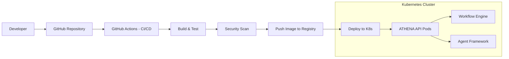

# Production Deployment Specification

## Metadata
- **Status**: Approved
- **Author**: DevOps Lead
- **Version**: 1.0
- **Date**: 2024-05-22
- **Reviewers**: Chief Architect, Platform Engineer

## Purpose
The purpose of this document is to define the technical design and implementation requirements for the production deployment of the ATHENA platform. It covers containerization, orchestration, and continuous integration/delivery (CI/CD).

## Background
ATHENA is designed as a cloud-native, enterprise-grade platform. A robust deployment strategy is required to ensure scalability, reliability, and security in a production environment.

## Goals
1. **Enable Containerization**: Provide a standardized Docker environment for all platform components.
2. **Orchestrate via Kubernetes**: Use K8s for managing agent workloads and API services.
3. **Automate CI/CD**: Implement automated testing and deployment pipelines.
4. **Ensure Cloud Native Standards**: Follow best practices for logging, monitoring, and state management in a distributed system.

## Requirements

### Functional Requirements
1. **Image Building**:
   - Automated building of Docker images for the ATHENA API.
   - Capability to include all core framework dependencies.
2. **Kubernetes Orchestration**:
   - Deployment of API services as K8s deployments.
   - Handling of asynchronous agent tasks via K8s jobs or persistent pods.
3. **CI/CD Pipeline**:
   - Automatic execution of unit and integration tests on every commit.
   - Build verification and image security scanning.

### Technical Requirements
1. **Dockerfile**: Multi-stage build to minimize image size and maximize security.
2. **Kubernetes Manifests**: YAML-based definitions for Deployments, Services, and ConfigMaps.
3. **GitHub Actions**: Use Actions for CI/CD automation.

## Architecture

## Implementation
Implementation begins with the `Dockerfile` and foundational K8s manifests in `deploy/k8s/`.

## Examples
*Building Image*:
`docker build -t athena-api:latest .`

## Acceptance Criteria
- Successful build of a Docker image containing the ATHENA core and API.
- Verification of a local deployment using the Kubernetes manifests (e.g., via Minikube/Kind).
- Passing CI pipeline in GitHub Actions.
- Adherence to the "Security First" principle in the Docker and K8s configuration.

## References
- [Master Engineering Specification](../specifications/MASTER_ENGINEERING_SPECIFICATION.md)
- [API Framework Specification](API_FRAMEWORK_SPECIFICATION.md)
- [ADR 0006: High Level Architecture Baseline](../architecture/adr/0006-high-level-architecture-baseline.md)
