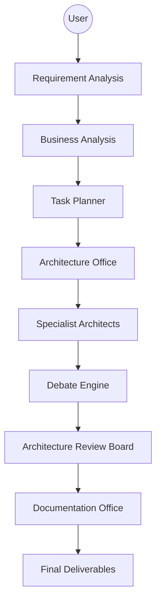

# Product Requirements Document (PRD)

## Metadata
- **Status**: Approved
- **Author**: Lead Product Manager
- **Version**: 1.0
- **Date**: 2024-05-22
- **Reviewers**: Chief Architect, Executive Office

## Purpose
The purpose of this document is to define the functional and non-functional requirements for ATHENA (Adaptive Thinking Hub for Enterprise Network & Architecture), an enterprise-grade multi-agent AI consulting platform.

## Background
Elite consulting organizations currently rely on highly skilled human professionals to perform complex architectural analysis and solution design. ATHENA aims to automate and enhance this process by creating an autonomous consulting organization powered by a multi-agent AI architecture.

## Goals
1. **Elite Consulting Capability**: Perform work at the level of top-tier consulting firms (Google, Microsoft, Amazon, IBM, etc.).
2. **Autonomous Operation**: Function as an autonomous organization with minimal human intervention for core tasks.
3. **Enterprise Grade**: Ensure the platform is scalable, secure, and maintainable.
4. **Architectural Excellence**: Produce high-quality architecture deliverables including diagrams, documents, and code.

## Requirements

### Functional Requirements
1. **Multi-Agent Orchestration**:
   - Support for a wide range of specialized architect roles (Chief, Solution, Security, Cloud, etc.).
   - Efficient communication and task delegation between agents.
2. **Analysis Capabilities**:
   - Analyze RFPs, RFIs, RFQs, SoWs, and existing architecture documents.
   - Evaluate cloud environments, migration strategies, and cost models.
3. **Deliverable Generation**:
   - Generate Word, PowerPoint, and Excel documents.
   - Produce architecture diagrams (Mermaid, PlantUML).
   - Generate infrastructure code (Terraform, Bicep, CloudFormation).
   - Generate Kubernetes YAML and CI/CD pipelines.
4. **Workflow & Governance**:
   - Implement a multi-stage workflow from requirement analysis to final delivery.
   - Incorporate a Debate Engine to challenge proposals and ensure consensus.
   - Support for an Architecture Review Board (ARB) approval process.

### Non-Functional Requirements
1. **LLM Agnostic**: Support for various LLMs (OpenAI, Anthropic, Gemini, DeepSeek, etc.) and local models.
2. **Scalability**: Ability to handle multiple concurrent consulting projects and complex architectures.
3. **Security**: Maintain high security standards for analyzing sensitive enterprise environments.
4. **Traceability**: All decisions must be recorded via ADRs and traceable to specific agent actions.
5. **Modularity**: A plugin-based tool framework for easy extension.

## Architecture
ATHENA is based on a multi-agent, event-driven architecture.

## Implementation
Implementation follows a phased approach as defined in the Master Engineering Specification.

## Examples
*Example Scenario*: A client submits an RFP for a cloud migration project. ATHENA's agents collaborate to analyze the requirements, debate the best migration strategy (e.g., Rehost vs. Refactor), and produce a comprehensive Solution Architecture document.

## Acceptance Criteria
- Successful analysis of a sample RFP.
- Generation of a complete Architecture Decision Record (ADR).
- Production of valid Terraform code and Mermaid diagrams for a reference implementation.
- Consensus reached through the Debate Engine for a complex architectural choice.

## References
- [Master Engineering Specification](MASTER_ENGINEERING_SPECIFICATION.md)
- [ADR 0002: Repository Structure](../architecture/adr/0002-repository-structure.md)
