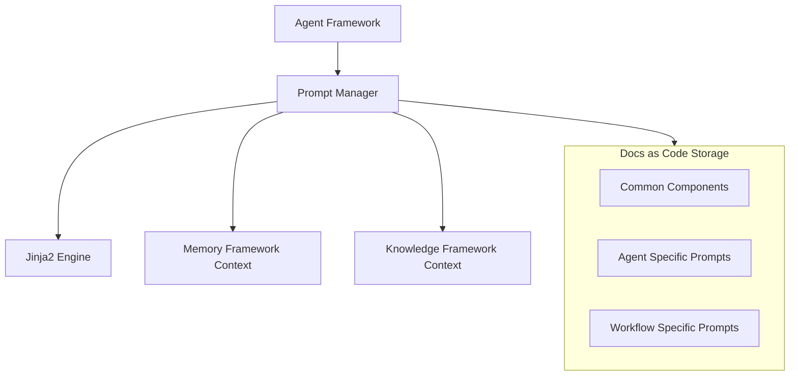

# Prompt Framework Specification

## Metadata
- **Status**: Approved
- **Author**: Lead Prompt Engineer
- **Version**: 1.0
- **Date**: 2024-05-22
- **Reviewers**: Chief Architect, Chief AI Architect

## Purpose
The purpose of this document is to define the technical design and implementation requirements for the ATHENA Prompt Framework. This framework is responsible for managing, templating, and versioning the complex instructions (prompts) that govern agent behavior.

## Background
ATHENA relies on a large number of specialized agents. Consistent and high-quality prompt management is critical to ensure that agents perform their roles accurately and adhere to the project's engineering standards.

## Goals
1. **Centralize Prompt Management**: Provide a single repository for all agent prompts and shared instruction components.
2. **Support Dynamic Templating**: Enable the injection of context (Memory, Knowledge, Task data) into prompts at runtime.
3. **Ensure Consistency**: Enforce standard formatting and instructional patterns across all agent prompts.
4. **Implement Version Control**: Ensure prompts are versioned and traceable, consistent with the "Docs as Code" philosophy.

## Requirements

### Functional Requirements
1. **Prompt Templating**:
   - Support for variables and conditional logic within prompts.
   - Capability to compose prompts from reusable components (e.g., "Standard Output Format", "Persona Header").
2. **Context Injection**:
   - Interface to inject data from the Memory Framework and Knowledge Framework into the prompt template.
3. **Agent Mapping**:
   - Map specific prompt templates to agent roles (e.g., "Security Architect Prompt").
4. **Versioning**:
   - Support for loading specific versions of a prompt template.

### Technical Requirements
1. **Templating Engine**: Use Jinja2 for flexible and powerful prompt generation.
2. **Markdown Storage**: Prompts are authored and stored as Markdown/Text files in `docs/prompts/`.
3. **Integration**: Direct integration with the Agent Framework to provide rendered prompts during agent initialization or task execution.

## Architecture



## Implementation
Implementation begins with the `PromptManager` in `src/athena/core/prompt.py`.

## Examples
*Prompt Rendering*:
```python
rendered_prompt = await prompt_manager.render_agent_prompt(
    role="security-architect",
    context={"project_name": "Project Alpha", "task": "Compliance Review"}
)
```

## Acceptance Criteria
- Successful rendering of a sample agent prompt using Jinja2 templates.
- Verification that shared components can be included in multiple agent prompts.
- Demonstration of context injection from a mock memory object.
- Compliance with the defined directory structure in `docs/prompts/`.

## References
- [Master Engineering Specification](../specifications/MASTER_ENGINEERING_SPECIFICATION.md)
- [Agent Framework Specification](AGENT_FRAMEWORK_SPECIFICATION.md)
- [ADR 0003: Documentation Standards](../architecture/adr/0003-documentation-standards.md)
