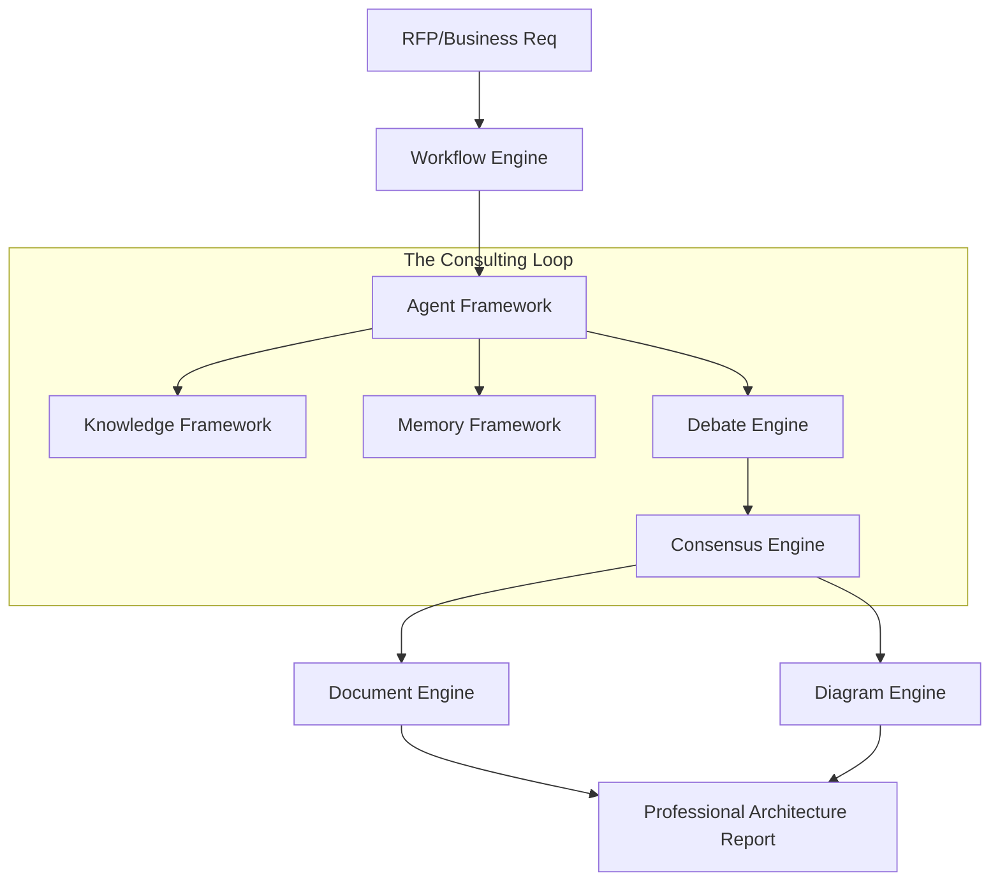

# Reference Implementation Specification

## Metadata
- **Status**: Approved
- **Author**: Lead Software Engineer
- **Version**: 1.0
- **Date**: 2024-05-22
- **Reviewers**: Chief Architect, Principal AI Engineer

## Purpose
The purpose of this document is to define the "Cloud Migration Strategy" scenario that serves as the first end-to-end reference implementation for the ATHENA platform. This implementation demonstrates the integration of all core frameworks and validates the platform's consulting capabilities.

## Background
To prove the platform's viability, a concrete implementation of a complex consulting task is required. This reference implementation exercises the Agent, Knowledge, Memory, Workflow, Debate, Consensus, Document, and Diagram frameworks.

## Goals
1. **Validate Integration**: Prove that all core frameworks work together as specified.
2. **Demonstrate Consulting Workflow**: Execute a multi-stage process from requirement analysis to final deliverable.
3. **Showcase "Critical Thinking"**: Exercise the Debate and Consensus engines in a realistic scenario.
4. **Produce Professional Deliverables**: Generate a comprehensive architectural report and diagrams.

## Requirements

### Reference Scenario: Cloud Migration Strategy
1. **Input**: A business requirement for migrating a legacy monolithic application to a cloud-native architecture.
2. **Workflow Stages**:
   - **Requirement Analysis**: Chief Architect analyzes the input.
   - **Specialist Analysis**: Cloud Architect proposes a serverless migration; Security Architect challenges it.
   - **Debate**: Iterative rounds of tradeoffs (Cold starts, IAM roles, Costs).
   - **Consensus**: Senior Architect (Engine) reaches a final migration path.
   - **Deliverable Generation**: Document Engine produces a Markdown report; Diagram Engine produces a Mermaid architecture diagram.

### Functional Requirements
1. **End-to-End Execution**: Capability to run the entire scenario with a single command.
2. **Observable Traceability**: Logs and memory captures for every stage.
3. **Real Deliverables**: Non-simulated output files (Markdown, Mermaid).

## Architecture

## Implementation
Implementation is located in `src/athena/reference_run.py` and supported by integration tests.

## Examples
*Executing Reference Implementation*:
`python3 src/athena/reference_run.py --project migration-demo`

## Acceptance Criteria
- Successful completion of the entire 5-stage workflow.
- Generation of a Consensus Report with all 10 mandatory recommendation sections.
- Verification that the final deliverable contains a valid Mermaid diagram.
- All integration tests pass.

## References
- [Master Engineering Specification](../specifications/MASTER_ENGINEERING_SPECIFICATION.md)
- [Workflow Engine Specification](WORKFLOW_ENGINE_SPECIFICATION.md)
- [Debate Engine Specification](DEBATE_ENGINE_SPECIFICATION.md)
