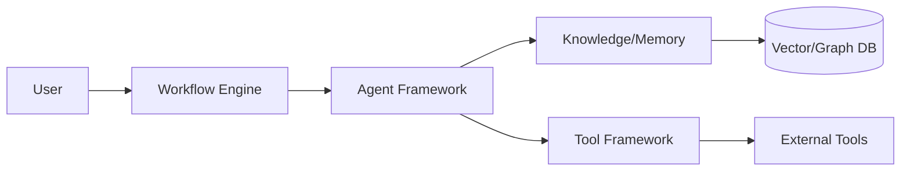

# Software Requirements Specification (SRS)

## Metadata
- **Status**: Approved
- **Author**: Lead Software Architect
- **Version**: 1.0
- **Date**: 2024-05-22
- **Reviewers**: Chief Architect, Senior Solution Architect

## Purpose
The purpose of this document is to provide a detailed description of the software requirements for the ATHENA platform. It defines the technical components, interfaces, and constraints required to realize the product requirements.

## Background
Following the establishment of the Product Requirements Document (PRD), the SRS translates these into technical specifications for the engineering team.

## Goals
1. **Define System Architecture**: Specify the high-level components and their interactions.
2. **Detail Interface Requirements**: Define APIs, external integrations, and communication protocols.
3. **Specify Data Requirements**: Define data models, storage, and processing requirements.
4. **Enforce Technical Constraints**: Document the constraints on LLM usage, scalability, and security.

## Requirements

### Technical Requirements
1. **Multi-Agent Framework**:
   - The framework must support asynchronous communication between agents.
   - Each agent must have a clearly defined state machine for task execution.
   - Support for pluggable agent roles and capabilities.
2. **Workflow Engine**:
   - Must support complex, multi-stage workflows as defined in the Master Engineering Specification.
   - Capability to handle parallel specialist analysis and sequential review processes.
3. **Debate & Consensus Engine**:
   - Implementation of a mechanism for agents to challenge proposals (Debate Engine).
   - A consensus engine to evaluate agent recommendations and reach a final decision.
4. **Tool Framework**:
   - A plugin-based architecture for integrating external tools (Terraform, kubectl, GitHub, etc.).
   - Support for Model Context Protocol (MCP).

### System Interfaces
1. **External APIs**:
   - Integration with LLM providers (OpenAI, Anthropic, Gemini, etc.) via a unified interface.
   - Integration with collaboration tools (Slack, Teams, Jira, Confluence).
2. **Internal Interfaces**:
   - Communication between the Knowledge Office, Memory Framework, and the Workflow Engine.

### Data Requirements
1. **Memory Architecture**:
   - Implementation of Conversation, Working, Semantic, Long Term, and Organizational memory.
   - Integration with Vector Databases for semantic search and retrieval.
2. **Knowledge Graph**:
   - Storage of architecture patterns, reference architectures, and lessons learned.

### Architectural Constraints
1. **LLM Agnostic**: The system must not be tied to a specific LLM provider.
2. **Documentation First**: All architectural changes must be documented via ADRs.
3. **Security First**: High security standards for data at rest and in transit.

## Architecture
The system follows a modular, plugin-based architecture.

## Implementation
Implementation will proceed milestone by milestone, starting with the Agent Framework (Phase 5).

## Examples
*System Interaction*: The Workflow Engine triggers the Chief Architect agent, which then delegates a "Cloud Security Review" task to the Security Architect agent. The Security Architect uses the Tool Framework to scan a cloud environment and stores the results in the Project Memory.

## Acceptance Criteria
- Integration with at least two different LLM providers.
- Successful execution of a multi-agent workflow with at least three different architect roles.
- Documentation of at least one complex architectural decision through the Debate Engine.
- Verification of data persistence in all memory tiers.

## References
- [Master Engineering Specification](MASTER_ENGINEERING_SPECIFICATION.md)
- [Product Requirements Document](PRODUCT_REQUIREMENTS_DOCUMENT.md)
- [ADR 0004: Product Requirements Baseline](../architecture/adr/0004-product-requirements-baseline.md)
