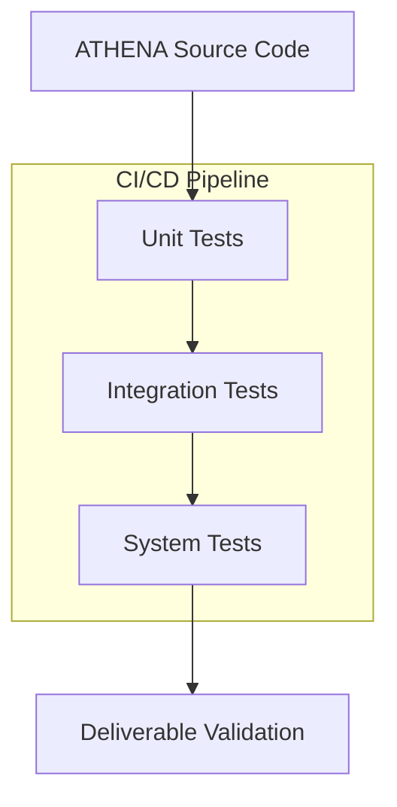

# Testing Specification

## Metadata
- **Status**: Approved
- **Author**: Quality Reviewer
- **Version**: 1.0
- **Date**: 2024-05-22
- **Reviewers**: Chief Architect, Lead Software Engineer

## Purpose
The purpose of this document is to define the comprehensive testing strategy for the ATHENA platform. It establishes the standards, levels, and tools required to ensure enterprise-grade reliability and architectural quality.

## Background
As an elite AI consulting organization, ATHENA must produce accurate and consistent outputs. A multi-layered testing approach is required to validate individual agent behaviors, inter-agent communication, and full system workflows.

## Goals
1. **Ensure Functional Correctness**: Verify that all core engines and agents perform as specified.
2. **Validate Integration**: Ensure seamless data flow and communication between frameworks.
3. **Maintain High Quality**: Implement rigorous checks for architectural deliverables (documents and diagrams).
4. **Support Regression Testing**: Automated suites to prevent new changes from breaking existing functionality.

## Requirements

### Testing Levels
1. **Unit Testing**:
   - Focus: Individual classes and methods (e.g., `MemoryManager.store`).
   - Tool: `pytest`.
2. **Integration Testing**:
   - Focus: Interaction between components (e.g., `WorkflowEngine` triggering an `Agent`).
   - Tool: `pytest` with async support.
3. **System Testing**:
   - Focus: End-to-end consulting scenarios via the API (e.g., the complete "Cloud Migration" flow).
   - Tool: `FastAPI TestClient`, `httpx`.
4. **Deliverable Validation**:
   - Focus: Validation of Mermaid syntax and Markdown structure.
5. **Performance Testing**:
   - Focus: Latency and throughput of multi-agent interactions.

### Functional Requirements
1. **Automated Execution**: All tests must be runnable via CI/CD.
2. **Mocking Strategy**: Use mocks for external LLM calls and third-party tools to ensure deterministic testing.
3. **Coverage Standards**: Aim for high test coverage across core framework logic.

## Architecture

## Implementation
Implementation is distributed across the `tests/` directory (unit, integration, system).

## Examples
*Running All Tests*:
`PYTHONPATH=src pytest tests/`

## Acceptance Criteria
- 100% pass rate for the reference implementation integration test.
- Successful execution of the full "Consulting Loop" system test.
- Verification of API endpoint response integrity.
- Automated CI pipeline verification for every commit.

## References
- [Master Engineering Specification](../specifications/MASTER_ENGINEERING_SPECIFICATION.md)
- [Reference Implementation Specification](REFERENCE_IMPLEMENTATION_SPECIFICATION.md)
- [ADR 0019: Production Deployment Strategy](../architecture/adr/0019-production-deployment-strategy.md)
