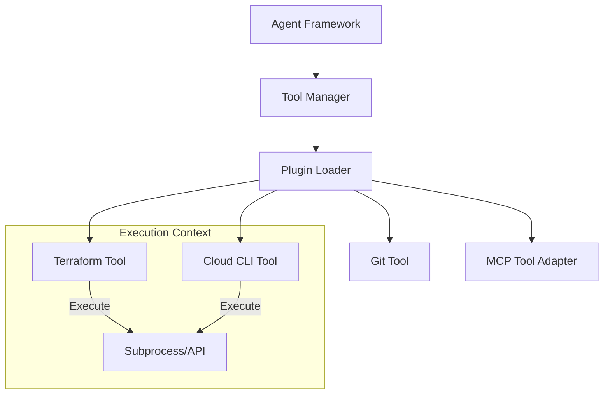

# Tool Framework Specification

## Metadata
- **Status**: Approved
- **Author**: Platform Engineer
- **Version**: 1.0
- **Date**: 2024-05-22
- **Reviewers**: Chief Architect, DevOps Lead

## Purpose
The purpose of this document is to define the technical design and implementation requirements for the ATHENA Tool Framework. This framework allows AI agents to interact with the external world (Cloud CLIs, Terraform, Git, etc.) via a secure, plugin-based architecture.

## Background
ATHENA agents must perform "real" work, such as analyzing cloud environments or generating infrastructure code. The Tool Framework provides a standardized way to expose technical capabilities to agents.

## Goals
1. **Enable External Interaction**: Provide agents with the ability to execute CLI commands and call external APIs.
2. **Implement Plugin Architecture**: Allow for easy addition of new tools without modifying the core system.
3. **Ensure Security & Governance**: Implement strict controls on which agents can use which tools and capture execution logs.
4. **Support Modern Protocols**: Provide native support for the Model Context Protocol (MCP).

## Requirements

### Functional Requirements
1. **Tool Registration**:
   - Interface to register new tools with metadata (Name, Description, Input Schema).
2. **Tool Execution**:
   - Capability to execute tools asynchronously.
   - Support for capturing stdout, stderr, and return codes for CLI tools.
3. **Agent Access Control**:
   - Role-based permissions for tool usage.
4. **MCP Integration**:
   - Implement an adapter to support MCP-compatible tools.

### Technical Requirements
1. **Base Class Implementation**: A `BaseTool` abstract class defining the execution interface.
2. **Async Support**: All tool executions must be non-blocking.
3. **Typed Inputs/Outputs**: Use Pydantic models for tool input validation and output formatting.
4. **Environment Isolation**: Ensure tools run in a controlled and isolated environment where possible.

## Architecture



## Implementation
Implementation begins with the `ToolManager` and `BaseTool` in `src/athena/core/tool.py`.

## Examples
*Tool Execution*:
```python
terraform_tool = ToolManager.get_tool("terraform-plan")
result = await terraform_tool.execute(working_dir="./infra")
```

## Acceptance Criteria
- Successful registration and discovery of a mock tool.
- Execution of a CLI-based tool and capture of its output.
- Verification of input validation using Pydantic schemas.
- Implementation of the `BaseTool` interface.

## References
- [Master Engineering Specification](../specifications/MASTER_ENGINEERING_SPECIFICATION.md)
- [Agent Framework Specification](AGENT_FRAMEWORK_SPECIFICATION.md)
- [ADR 0014: Diagram Engine Design](../architecture/adr/0014-diagram-engine-design.md)
