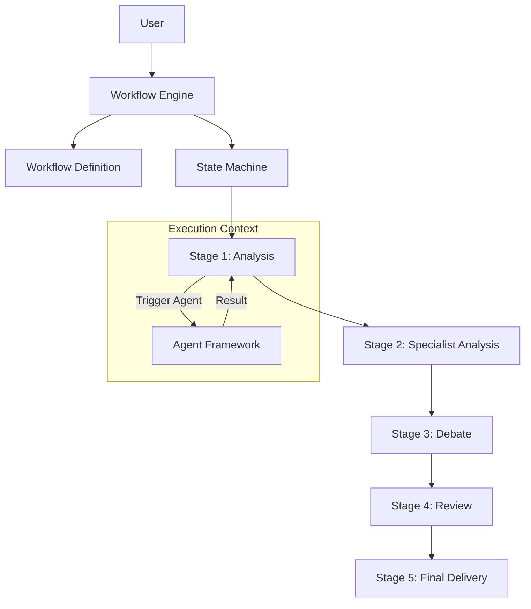

# Workflow Engine Specification

## Metadata
- **Status**: Approved
- **Author**: Lead Software Architect
- **Version**: 1.0
- **Date**: 2024-05-22
- **Reviewers**: Chief Architect, Project Manager

## Purpose
The purpose of this document is to define the technical design and implementation requirements for the ATHENA Workflow Engine. This engine is responsible for orchestrating the multi-agent consulting process from initial requirement analysis to final deliverable generation.

## Background
ATHENA's consulting value is delivered through complex, multi-stage workflows involving various specialized agents, debate cycles, and review boards. A robust engine is required to manage these states and transitions reliably.

## Goals
1. **Orchestrate Complex Tasks**: Manage multi-agent workflows with sequential and parallel stages.
2. **Implement State Management**: Track the state of each workflow and its constituent tasks.
3. **Ensure Reliability**: Support workflow persistence, error handling, and recovery.
4. **Enable Human-in-the-loop**: Provide hooks for human review and approval at critical stages (e.g., ARB).

## Requirements

### Functional Requirements
1. **Workflow Definition**:
   - Capability to define workflows as a series of stages (Requirement Analysis, Specialist Analysis, Debate, Review, etc.).
   - Support for Directed Acyclic Graph (DAG) structures for complex task dependencies.
2. **Stage Management**:
   - Every stage must have clear input and output requirements.
   - Support for automated and manual (human-reviewed) transitions.
3. **Task Delegation**:
   - Capability to delegate specific tasks to agents based on their roles.
4. **State Persistence**:
   - Workflows must be persistable to allow for long-running operations.

### Technical Requirements
1. **Event-Driven Architecture**: Use events to trigger stage transitions and agent actions.
2. **Async Execution**: The engine must be entirely non-blocking.
3. **Pydantic Models**: Use typed models for workflow definitions and state.
4. **Extensibility**: Support for custom workflow types and stages.

## Architecture



## Implementation
Implementation begins with the `WorkflowEngine` and core workflow models in `src/athena/core/workflow.py`.

## Examples
*Consulting Workflow Execution*:
```python
workflow = ConsultingWorkflow(project_id="p-001")
await engine.start_workflow(workflow)
# Engine triggers Requirement Analyst agent
```

## Acceptance Criteria
- Successful execution of a 3-stage linear workflow.
- Demonstration of parallel execution of two stages.
- Verification of state persistence across a simulated engine restart.
- Implementation of a "Review" stage that requires external approval.

## References
- [Master Engineering Specification](../specifications/MASTER_ENGINEERING_SPECIFICATION.md)
- [Software Requirements Specification](../specifications/SOFTWARE_REQUIREMENTS_SPECIFICATION.md)
- [Agent Framework Specification](AGENT_FRAMEWORK_SPECIFICATION.md)
