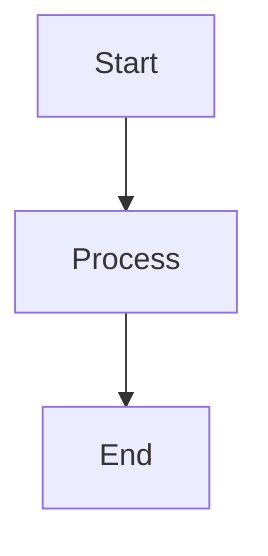

# [Document Title]

## Metadata
- **Status**: [Draft/Review/Approved]
- **Author**: [Author Name/Agent Role]
- **Version**: 1.0
- **Date**: [YYYY-MM-DD]
- **Reviewers**: [Reviewer Names/Agent Roles]

## Purpose
[Briefly describe the purpose of this document.]

## Background
[Provide context and background information.]

## Goals
[What are we trying to achieve with this component/feature?]

## Requirements
[List the specific requirements.]

## Architecture
[Describe the architectural design, including diagrams if necessary.]

### Mermaid Diagram

## Implementation
[Provide details on how to implement this component/feature.]

## Examples
[Provide usage examples or code snippets.]

## Acceptance Criteria
[List the criteria that must be met for this to be considered complete.]

## References
[List any reference materials or related documents.]
